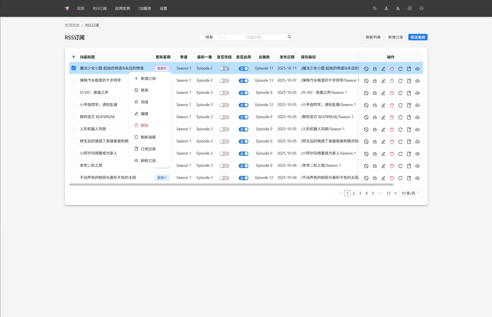
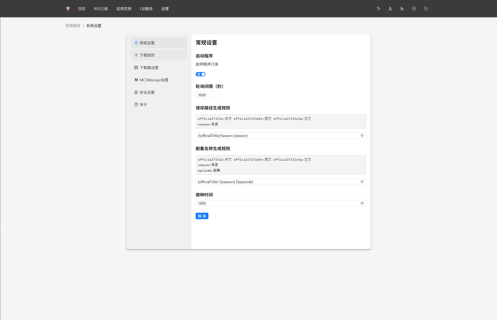

<h1 align="center" style="margin: 30px 0 30px; font-weight: bold;">AutoBangumi</h1>
<h4 align="center">基于SpringBoot3、Vue3的Rss订阅</h4>

# 简介

> 我非常感谢 MCSManage、Sz-Admin 和 AutoBangumi 这几个优秀的开源项目！ 我的项目在设计上主要参考了 MCSManage 的前端实现、Sz-Admin 的后端架构，以及 AutoBangumi 的功能思路。

> 本项目最初的动机源于个人对 AutoBangumi 的使用体验。
虽然 AutoBangumi 功能非常优秀，但其中一些功能在实际使用中遇到了不少困扰。
同时个人原因并不熟悉 Python，因此决定基于 Java 重新设计一个更符合个人需求的 RSS 订阅自动化工具。

## 在线体验

- 代码仓库：https://github.com/RuningFastChack/auto-bangumi

## 系统要求

- JDK >= 17
- SqlIte
- Maven >= 3.8
- Node >= 18.x
- McsManage = 10.4.0 终端、文件管理需要用到该管理面板（我在用的）
- QBitTorrent = 4.5.4.10 用于推送下载、重名等功能（我在用的）

## 核心技术

- **SpringBoot 3.x：** 最新的Spring Boot版本，提供更优的性能和更丰富的特性。
- **Sa-Token**：一个轻量级 Java 权限认证框架，简化权限认证，保障应用的安全性。
- **Mybatis Flex**：一个优雅的 `MyBatis` 增强框架，它非常轻量、同时拥有极高的性能与灵活性。
- **Flyway**：`数据库版本控制`工具，确保数据库迁移的可靠性。

- **Vue 3.x**：采用 `Vue 3.x`，Vue.js 的最新稳定版本，提供更强的性能和更丰富的功能，构建响应式用户界面。
- **Vite 5.x**：使用 `Vite 5`.x 作为前端开发和构建工具，它利用现代浏览器的原生 ES 模块导入特性，提供了快速的冷启动和即时模块热更新。
- **TypeScript**：通过 `TypeScript` 的集成，引入静态类型检查，增强了代码的可维护性和可读性，提前避免潜在的错误。
- **Pinia**：状态管理采用 `Pinia`，这是 Vue 3 的解构式状态管理库，它简单、灵活且易于使用，优化了应用的状态管理。
- **Antd**：一个基于 Vue 3 的组件库，提供了一系列高质量的 UI 组件，帮助开发者快速构建美观、功能完备的用户界面。

## 功能列表
- **登记功能**：
- **日历**：查看当前订阅RSS更新日期
- **订阅管理**：负责管理订阅RSS
- **终端**：查看日志记录、重启项目
- **文件管理**：用于下载、上传、编辑等功能
- **设置**：负责管理系统绝大部分设置
## 系统美照

<table>
    <tr>
        <td></td>
        <td></td>
    </tr>
    <tr>
        <td></td>
        <td></td>
    </tr>
    <tr>
        <td></td>
        <td></td>
    </tr>
    <tr>
        <td></td>
    </tr>
    <tr>
        <td></td>
        <td></td>
    </tr>
    <tr>
        <td></td>
        <td></td>
    </tr>
    <tr>
        <td></td>
        <td></td>
    </tr>
    <tr>
        <td></td>
        <td></td>
    </tr>
</table>

----

## 计划：

- 整合QBitTorrent管理界面
